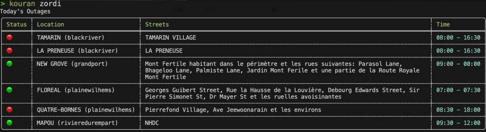

# Kouran
`kouran` is a simple CLI tool that provides information on power outages in Mauritius. 
The data is sourced from a [dataset](https://github.com/MrSunshyne/mauritius-power-outages) created by [Sandeep Ramgolam](https://github.com/MrSunshyne).



## Features

* Display power outages for today.
* View upcoming outages for tomorrow.
* Use the all subcommand to get information on outages for both today and tomorrow.

## Installation

You can install `kouran` using one of the following methods:

### Using Cargo

If you have Rust's package manager, Cargo, installed, you can install `kouran` with:

```bash
cargo install kouran
```

### Using Homebrew

For macOS users, you can install `kouran` using Homebrew:

```bash
brew install k3ii/tap/kouran
```
Check the release page to install the pre-built binaries.

## Motivation

The primary motivation behind kouran is to gain hands-on experience with building CLI tools in Rust language and interacting with APIs. While the tool is still simple, it offers a functional and helpful utility for anyone looking to stay updated on power outages across Mauritius from their terminal.
